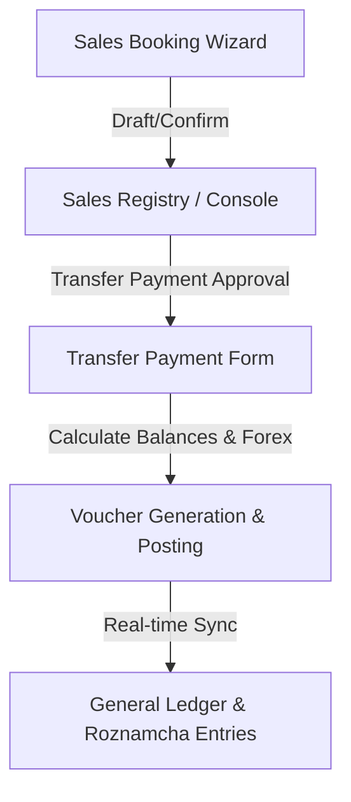

# Sales Booking Module Specification

This document details the functional, architectural, and translation requirements for the **Sales Booking Module**. The module must match the existing **Purchase Booking Module** in design, workflows, business logic, and multilingual capability, while retaining independent data boundaries (independent serials, accounting postings, and translations).

---

## 1. Process Workflow

The Sales process must follow the same multi-step lifecycle as the Purchase module:

1. **Sales Booking**: Multi-step wizard to register buyer credentials, product metrics, and port details.
2. **Sales Transfer Payment**: Reconciles the booking and processes payments (Advance/Final).
3. **Final Accounting Posting**: Auto-generates double-entry vouchers in the General Ledger.

---

## 2. Parity with Purchase Module

The Sales Booking Module must implement:
* **UI/UX Design**: Same premium styled layouts, steps progress trackers, cards, and interactive selects.
* **Remaining-Balance Logic**: Automated tracking of `orderTotal`, `paidAmount`, and `remainingAmount`.
* **Voucher Approvals**: Restrict edits once a booking has been confirmed or transferred unless super admin permissions are granted.
* **Exports & Actions**: Built-in support for printing receipts, PDF exports, and Excel downloads.
* **Permission Bounds**: Scoped view permissions restricted by Country ID, Country Branch ID, and City Branch ID.

---

## 3. Independent Serial Numbers

Sales records must utilize independent serial counters. These sequences must never mix with or overwrite Purchase serials:

| Serial Type | Scope | Counter Prefix |
| :--- | :--- | :--- |
| **Sales Serial Number** | Global Module | `SO` |
| **General Journal Serial Number** | Global Ledger | `JV` |
| **Country Serial Number** | Isolated by Country | (Dynamic per Country Country-ISO) |
| **Branch Serial Number** | Isolated by Branch | (Dynamic per Branch Code) |
| **Bill / Invoice Number** | Global Sales | `INV` or custom |
| **Transfer Serial Number** | Global Payments | `TR` |
| **Payment Serial Number** | Global Payments | `PAY` |

---

## 4. Multi-Currency & Forex Rules

Supports identical two-currency rules to track exchange adjustments:
* **Original Sales Currency**: The currency in which the deal was closed (e.g. USD).
* **Final / Local Currency**: The base currency of the branch/country context.
* **Exchange Rate**: Real-time or manual exchange conversion factor.
* **Final Converted Amount**: Auto-calculated base-currency value used for ledger ledger postings.

---

## 5. Five-Language (I18n) Support

The module must support all five system languages natively across all labels, menus, error messages, and A4 invoice formats:

* **English** (LTR)
* **Urdu** (RTL)
* **Pashto** (RTL)
* **Farsi** (RTL)
* **Arabic** (RTL)

> [!IMPORTANT]
> All labels and translation keys must be registered with the centralized translation API. No text or message should be hardcoded in a single language.

### Database Integration
Multilingual fields (names, remarks, goods description) must:
* Save in UTF-8 Unicode format.
* Support RTL alignments for Middle Eastern scripts.
* Retain original values without corruption or duplication when UI language is toggled.
